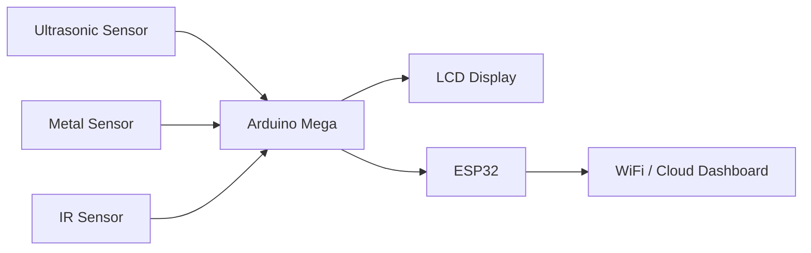
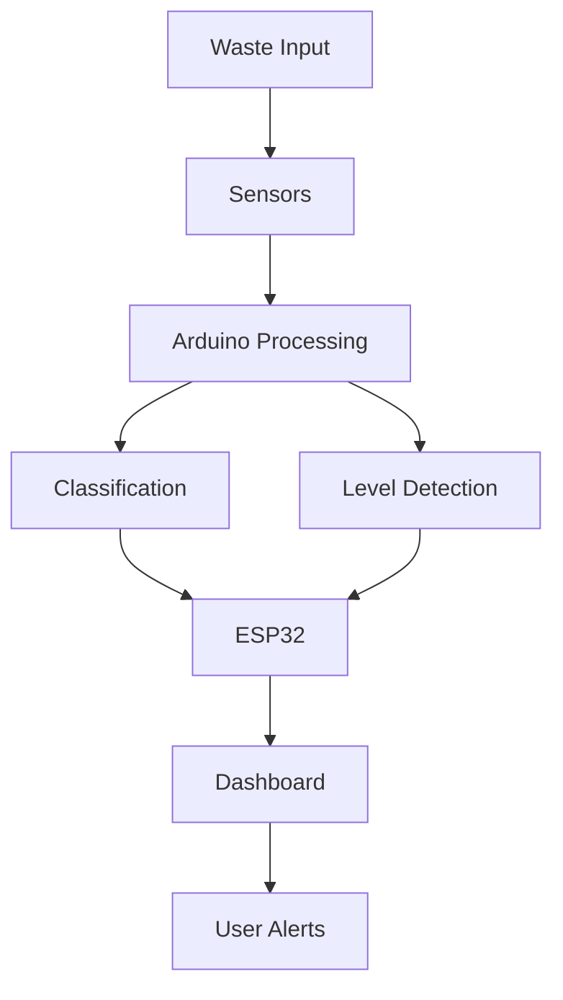

# ♻️ Smart Dustbin with Waste Segregation & Monitoring System


---

## 📌 Project Overview
This project presents a **Smart Dustbin** prototype that combines **Embedded Systems and AI-based classification** to automatically segregate waste and monitor bin status in real time.

It identifies materials like **plastic and metal**, tracks bin levels, and sends alerts via a **real-time IoT dashboard**.

---

## 📷 Real Project Images

### 🔌 Hardware (ESP32 + Sensors)


### 📊 Dashboard Interface


### 🗑️ Smart Dustbin Prototype


> 📁 Place your images inside a folder named `images/` in your repo and rename accordingly.

---

## 🚀 Features
- 🔍 Automatic Waste Segregation (Plastic / Metal)
- 📊 Real-Time Bin Level Monitoring
- 📡 IoT Dashboard Integration
- 🚨 Alerts when bin is full
- 💡 Embedded + AI Hybrid System

---

## 🛠️ Hardware Components
- Arduino Mega 2560
- ESP32 (Wi-Fi Module)
- Ultrasonic Sensor (HC-SR04)
- IR / Metal Detection Sensors
- LCD Display (16x2)
- LEDs

---

## 🔌 Circuit Diagram



---

## 🧠 System Architecture



---

## 💻 Code Snippets

### 🔹 Arduino (Sensor + Classification)
```cpp
int metalSensor = 2;
int irSensor = 3;

void setup() {
  pinMode(metalSensor, INPUT);
  pinMode(irSensor, INPUT);
  Serial.begin(9600);
}

void loop() {
  if (digitalRead(metalSensor) == HIGH) {
    Serial.println("Metal Detected");
  } else if (digitalRead(irSensor) == HIGH) {
    Serial.println("Plastic Detected");
  }
  delay(500);
}
```

### 🔹 ESP32 (Send Data to Dashboard)
```cpp
#include <WiFi.h>

const char* ssid = "YOUR_SSID";
const char* password = "YOUR_PASSWORD";

void setup() {
  WiFi.begin(ssid, password);
  while (WiFi.status() != WL_CONNECTED) {
    delay(1000);
  }
}

void loop() {
  // Send data to server/dashboard
}
```

---

## ⚙️ How It Works
1. Waste is inserted
2. Sensors detect material
3. Arduino classifies waste
4. Ultrasonic sensor checks bin level
5. ESP32 sends data to dashboard
6. User monitors and receives alerts

---

## 📊 Dashboard Features
- Bin Fill Percentage
- Visual Gauge Indicator
- Real-Time Monitoring

---

## 🔮 Future Improvements
- 🤖 AI Image Recognition
- 📱 Mobile App Integration
- ⚙️ Auto Segregation Mechanism
- ☁️ Cloud Analytics

---

## 🧪 Project Status
🚧 Prototype Completed

---

## 👨‍💻 Author
**Deepak**

---

⭐ Star this repo if you like the project!

